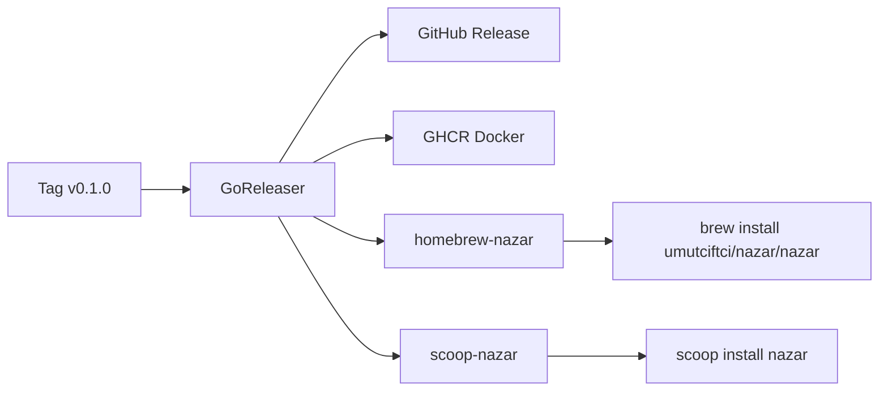

# First release checklist (maintainer)

Manual steps after merging OSS readiness changes. **Commit these file changes yourself** — nothing here is automated in git.

## Why two extra repos?

| Repo | Purpose |
|------|---------|
| [`umutciftci/nazar`](https://github.com/umutciftci/nazar) | Application source, tests, release workflow |
| [`umutciftci/homebrew-nazar`](https://github.com/umutciftci/homebrew-nazar) | Homebrew tap — `Formula/nazar.rb` (binary URL + SHA256) |
| [`umutciftci/scoop-nazar`](https://github.com/umutciftci/scoop-nazar) | Scoop bucket — `bucket/nazar.json` manifest |

GoReleaser does **not** put package recipes in the main repo. On each `v*` tag it commits updated formulas to the tap/bucket repos using PAT secrets.



---

## Step 1 — Create empty public repos

Create both on GitHub (no README required; empty is fine). Default branch: **`main`**.

1. https://github.com/new → name: **`homebrew-nazar`** → Public
2. https://github.com/new → name: **`scoop-nazar`** → Public

---

## Step 2 — Create fine-grained tokens

Path: **GitHub profile → Settings → Developer settings → Personal access tokens → Fine-grained tokens → Generate new token**

### Token A — Homebrew tap

| Field | Value |
|-------|--------|
| Token name | `nazar-homebrew-tap` |
| Resource owner | your account |
| Repository access | **Only select repositories** → `homebrew-nazar` |
| Permissions → Repository | **Contents: Read and write** |
| Expiration | 90 or 180 days (recommended) |

Copy the token once — you will not see it again.

### Token B — Scoop bucket

| Field | Value |
|-------|--------|
| Token name | `nazar-scoop-bucket` |
| Repository access | **Only select repositories** → `scoop-nazar` |
| Permissions → Repository | **Contents: Read and write** |
| Expiration | same as above |

You may use one token for both repos, but **two tokens** (least privilege per repo) is safer.

---

## Step 3 — Add secrets to the main `nazar` repo

Path: **`umutciftci/nazar` → Settings → Secrets and variables → Actions → New repository secret**

| Secret name | Value |
|-------------|--------|
| `HOMEBREW_TAP_TOKEN` | Token A (homebrew-nazar write) |
| `SCOOP_BUCKET_TOKEN` | Token B (scoop-nazar write) |
| `CODECOV_TOKEN` | Optional — from [codecov.io](https://codecov.io) after linking the repo |

Names must match exactly — [`.github/workflows/release.yml`](../.github/workflows/release.yml) reads these env vars.

`GITHUB_TOKEN` is provided by Actions automatically (releases + GHCR). No extra secret for that.

---

## Step 4 — Repository settings (main repo)

1. **Settings → General → Features** — enable **Issues**; enable **Discussions** (optional)
2. **Settings → Actions → General** — allow workflows read/write as needed
3. **Settings → Code security** — enable Dependabot alerts/updates; enable code scanning (CodeQL)

---

## Step 5 — Tag and release

```bash
git tag -a v0.1.0 -m "v0.1.0 — first public release"
git push origin v0.1.0
```

The **release** workflow runs GoReleaser, which publishes:

- GitHub Release archives (linux/darwin/windows)
- SBOM + cosign signatures on checksums
- `ghcr.io/umutciftci/nazar` Docker image
- Homebrew formula commit to `homebrew-nazar`
- Scoop manifest commit to `scoop-nazar`
- `.deb` / `.rpm` packages (on the release assets)

After the workflow succeeds, set **Packages → ghcr.io/umutciftci/nazar** to **Public** if it defaulted to private.

---

## Step 6 — Verify installs

**macOS / Linux (Homebrew)**

```bash
brew install umutciftci/nazar/nazar
nazar --version
```

**Windows (Scoop)**

```powershell
scoop bucket add nazar https://github.com/umutciftci/scoop-nazar
scoop install nazar
nazar --version
```

**Docker**

```bash
docker pull ghcr.io/umutciftci/nazar:latest
docker run --rm ghcr.io/umutciftci/nazar:latest --version
```

---

## Troubleshooting

| Problem | Likely cause |
|---------|----------------|
| Release fails on Homebrew step | Missing/wrong `HOMEBREW_TAP_TOKEN`, or `homebrew-nazar` repo does not exist |
| Release fails on Scoop step | Missing/wrong `SCOOP_BUCKET_TOKEN`, or `scoop-nazar` repo does not exist |
| `brew install` 404 | First release not finished yet; tap repo has no `Formula/nazar.rb` |
| `scoop install` fails | Bucket not added, or manifest not pushed yet |

Re-run by pushing a new patch tag after fixing secrets/repos.

---

## After release (optional)

- Open seed issues — see [GOOD_FIRST_ISSUES.md](GOOD_FIRST_ISSUES.md)
- Submit to awesome-go / awesome-security / awesome-cli-apps
- Post a release note on Discussions

## Branch name

CI listens on `main` and `master`. Default branch is `master` today; rename to `main` later if you prefer and update badge URLs in README.
